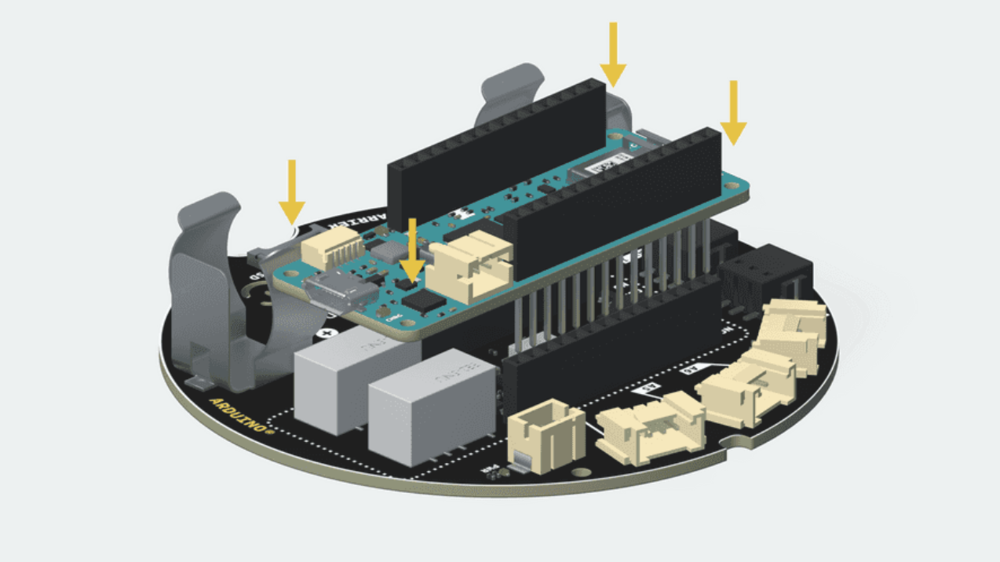

# Emotion Tracker with Arduino MKR wifi 1010 IoT Carrier

This code provides an example implementation of an emotion recorder using an Arduino MKR IoT Carrier board. The board has four touch buttons that correspond to different emotions, and it allows the user to record short audio clips for each emotion by pressing and holding the corresponding button. The board also has an LCD display that shows the status of each recording.

## Dependencies

This code uses the following libraries:

- Arduino_MKRIoTCarrier.h: This library provides the interface to the MKR IoT Carrier board, including the touch buttons, buzzer, and display.

## Usage

To use this code, you will need an Arduino MKR IoT Carrier and a MKR wifi 1010 board mount to the carrier.

The mounting should be look like this:

1. Connect the board to your computer via USB and upload the code using the Arduino IDE.

2. Once the code is uploaded, press and hold for 1.5 seconds for one of the five touch buttons to start recording a clip for the corresponding emotion. The screen display will show the emotion with a corresponding color to indicate that the emotion is ready to record. There will also a notification sound playing to notify that the recording has started.

3. During the recording of one of the emotion, you can press the button to record the intensity, the screen will update the intesity count and the device will also beep as the response of the intensity count is successfully recorded.

4. To stop the recording for current emotion, hold the same button for 1.5 seconds and the screen will update with 'Uploaded', a notification sound will also play to notify that the recording has ended.

Note that, once a specific emotion being recorded, the other buttons will be disabled, so you can not mess up with emotions and intensity counts. A demostration video is shown here.

https://youtube.com/shorts/BCA_86T021A?feature=share

## Code Structure
The code is structured as follows:

- The setup() function initializes the board and sets the initial state of the LCD display.
- The loop() function reads the state of each touch button and control the logic of the recordings.
- The check_other_if_recording() function checks whether any other buttons are currently recording, to prevent multiple recordings from occurring simultaneously.
- The reset_time() function resets the button pressed duration time for a button/emotion.
- The play_beep() function plays a short notification sound to indicate the start or end of a recording.
- The show() function updates the LCD display to show the status of a given command.
- The buttonPressStartTime[], buttonPressDuration[], buttonPressCount[], plus_now[], and recording_status[] arrays keep track of the state of each touch button and its corresponding emotion recording.

## Customization
You can customize this code by modifying the following variables:

- emotions[]: This array defines the names of the four emotions. You can change the names to fit your needs.
- colors[]: This array defines the colors used to display each emotion on the LCD display. You can change the colors to fit your preferences.
